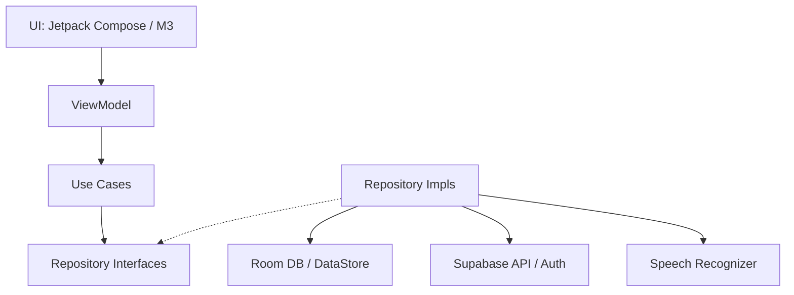

# NoorLearn - Interactive Islamic Learning Platform 🕌

NoorLearn is a modern, offline-first Android application designed to provide a comprehensive and interactive Islamic learning experience. The application features **AI-powered recitation feedback**, Hadith exploration, biographical histories of the Prophets, a roadmap-driven learning guide, translation vocabulary flashcards, and standard Islamic utility tools.

---

## 🏗️ Architectural Foundations

The application is engineered using **Clean Architecture** patterns, ensuring a decoupling of concerns, high testability, and a clear division between the presentation, domain, and data layers:

### Key Technical Specs
1. **Presentation Layer (MVVM)**: Built entirely using **Jetpack Compose** and **Material 3**. State management is driven by Kotlin `StateFlow` coupled with Hilt ViewModels.
2. **Domain Layer**: Contains pure Kotlin data models, repository abstractions, and modular `UseCases` (e.g., `SubmitRecitationUseCase`, `AskChatbotUseCase`).
3. **Data Layer (Offline-First)**:
   - **Local Cache**: [Room Database](file:///home/muzzu/Projects/Noor-Learn/android/app/src/main/kotlin/com/noorlearn/data/local/NoorLearnDatabase.kt) stores surah indices, ayah texts, and user reflections offline.
   - **Key-Value Settings**: [DataStore Preferences](file:///home/muzzu/Projects/Noor-Learn/android/app/src/main/kotlin/com/noorlearn/data/local/preferences/UserPreferencesDataStore.kt) manages user streaks, completed tasks, and onboarding metadata.
   - **Remote Backend**: **Supabase** handles authentication, database synchronization, and Edge Functions.
4. **AI Proxy**: OpenRouter (`stepfun/step-3.5-flash:free`) runs securely behind a Deno Edge Function in Supabase, keeping API keys hidden from client-side code.
5. **Dhikr & Alignment Engine**: Custom speech recognition and DP-based Levenshtein alignment compute real-time pronounciation feedback for Quran recitation.

---

## 📱 Detailed Screen & Page Guide

The user interface of NoorLearn is organized around a navigation graph containing main tabs and contextual learning screens:

### 1. Welcome & Onboarding
* **Onboarding Screen** ([OnboardingScreen.kt](file:///home/muzzu/Projects/Noor-Learn/android/app/src/main/kotlin/com/noorlearn/ui/screens/OnboardingScreen.kt))
  * **Role**: Configures the initial setup for new users.
  * **Features**: Allows selection of learning levels, commitments, and primary goals.
* **Authentication Screen** ([AuthScreen.kt](file:///home/muzzu/Projects/Noor-Learn/android/app/src/main/kotlin/com/noorlearn/ui/screens/AuthScreen.kt))
  * **Role**: User onboarding gateway.
  * **Features**: Supabase-powered login and registration forms with validation.

### 2. Main Tab Screens (Bottom Navigation)
* **Dashboard / Home Screen** ([DashboardScreen.kt](file:///home/muzzu/Projects/Noor-Learn/android/app/src/main/kotlin/com/noorlearn/ui/screens/DashboardScreen.kt))
  * **Role**: The central hub for user engagement.
  * **Features**: Displays streaks, daily journey progression, quick links to all secondary screens, recitation history charts, and a featured "Hadith of the Day".
* **Qur'an Surah List Screen** ([SurahListScreen.kt](file:///home/muzzu/Projects/Noor-Learn/android/app/src/main/kotlin/com/noorlearn/ui/screens/SurahListScreen.kt))
  * **Role**: Catalog of the Quran.
  * **Features**: Displays all 114 Surahs with revelation details (Meccan/Medinan), verse counts, and name translations. Includes a live-filtering search bar.
* **Ask AI Chatbot Screen** ([ChatbotScreen.kt](file:///home/muzzu/Projects/Noor-Learn/android/app/src/main/kotlin/com/noorlearn/ui/screens/ChatbotScreen.kt))
  * **Role**: Interactive theological query space.
  * **Features**: Conversational AI assistant (`NoorLearn AI`) backed by the Supabase OpenRouter proxy to guide users through general questions.
* **Islamic Tools Screen** ([ToolsScreen.kt](file:///home/muzzu/Projects/Noor-Learn/android/app/src/main/kotlin/com/noorlearn/ui/screens/ToolsScreen.kt))
  * **Role**: Home to essential utility sub-tabs.
  * **Sub-Features**:
    1. **Tasbeeh**: A digital counter supporting cycle loops for standard dhikrs (SubhanAllah, Alhamdulillah, Allahu Akbar).
    2. **Duas**: A categorised list of supplications with Arabic script, transliterations, and translations.
    3. **Qibla Finder**: Uses the device's magnetic and accelerometer sensors to compute real-time directional orientation towards the Kaaba.
* **Profile Screen** ([ProfileScreen.kt](file:///home/muzzu/Projects/Noor-Learn/android/app/src/main/kotlin/com/noorlearn/ui/screens/ProfileScreen.kt))
  * **Role**: User progression tracking.
  * **Features**: Summarizes learning statistics (minutes studied, surahs read, bookmarks, active/longest streaks) and handles account settings.

### 3. Contextual Learning Screens
* **Ayah Reader Screen** ([AyahReaderScreen.kt](file:///home/muzzu/Projects/Noor-Learn/android/app/src/main/kotlin/com/noorlearn/ui/screens/AyahReaderScreen.kt))
  * **Role**: Main interface for studying and reciting the Holy Quran.
  * **Features**:
    * **Audio Playback**: Custom ExoPlayer client streaming verse-by-verse recitations with support for different reciters.
    * **AI Tafseer/Explanation**: Request context-specific summaries for any Ayah.
    * **AI Recitation Feedback**: Users record their recitation via a microphone. The speech input is transcribed and aligned using [RecitationFeedbackEngine](file:///home/muzzu/Projects/Noor-Learn/android/app/src/main/kotlin/com/noorlearn/data/speech/RecitationFeedbackEngine.kt) via Levenshtein Distance. Individual words are highlighted in green (correct), red (incorrect), or gray (skipped), along with a total accuracy score.
    * **Bookmarks**: Direct toggle to save verses to bookmarks.
* **Hadith Hub Screen** ([HadithHubScreen.kt](file:///home/muzzu/Projects/Noor-Learn/android/app/src/main/kotlin/com/noorlearn/ui/screens/HadithHubScreen.kt))
  * **Role**: Exploration of Prophetic narrations.
  * **Features**: Categorized browsing, live search, and on-demand AI explanations outlining the practical lessons of each Hadith.
* **Prophet Stories Screen** ([ProphetStoriesScreen.kt](file:///home/muzzu/Projects/Noor-Learn/android/app/src/main/kotlin/com/noorlearn/ui/screens/ProphetStoriesScreen.kt))
  * **Role**: Historical and biographical learning.
  * **Features**: Rich story cards summarizing the lives of Quranic Prophets, supplemented by AI-generated reflective commentary.
* **Qaida Screen** ([QaidaScreen.kt](file:///home/muzzu/Projects/Noor-Learn/android/app/src/main/kotlin/com/noorlearn/ui/screens/QaidaScreen.kt))
  * **Role**: Arabic learning from scratch.
  * **Features**: Interactive grid of the 28 Arabic letters including English transliterations, pronunciation guides, and vocabulary examples.
* **Vocabulary Builder Screen** ([VocabularyBuilderScreen.kt](file:///home/muzzu/Projects/Noor-Learn/android/app/src/main/kotlin/com/noorlearn/ui/screens/VocabularyBuilderScreen.kt))
  * **Role**: Quranic word study.
  * **Features**: Interactive, flippable flashcards displaying Quranic vocabulary. Tracks word mastery and updates progress charts dynamically.
* **Reflection Journal Screen** ([ReflectionJournalScreen.kt](file:///home/muzzu/Projects/Noor-Learn/android/app/src/main/kotlin/com/noorlearn/ui/screens/ReflectionJournalScreen.kt))
  * **Role**: Active recall and personal contemplation.
  * **Features**: Let users write and save reflective journal logs in the local database.
* **Juz/Para Stories Screen** ([ParaStoriesScreen.kt](file:///home/muzzu/Projects/Noor-Learn/android/app/src/main/kotlin/com/noorlearn/ui/screens/ParaStoriesScreen.kt))
  * **Role**: Thematic Quran navigation.
  * **Features**: Outlines the structural themes, historical context, and major topics of each of the 30 Juz/Parts of the Quran.
* **Daily Journey Screen** ([DailyJourneyScreen.kt](file:///home/muzzu/Projects/Noor-Learn/android/app/src/main/kotlin/com/noorlearn/ui/screens/DailyJourneyScreen.kt))
  * **Role**: Habit loop tracker.
  * **Features**: Displays a roadmap path of daily learning milestones. Unlocks the daily tasks sequentially to encourage consistent learning habits.
* **Bookmarks Screen** ([BookmarksScreen.kt](file:///home/muzzu/Projects/Noor-Learn/android/app/src/main/kotlin/com/noorlearn/ui/screens/BookmarksScreen.kt))
  * **Role**: Quick reference to saved study content.
  * **Features**: Lists all saved Ayahs for quick retrieval.

---

## 🛠️ Data Infrastructure Summary

NoorLearn utilizes a unified local-remote data synchronisation structure:

| Model / Table | SQLite Room Cache | Supabase Sync | Purpose |
| :--- | :---: | :---: | :--- |
| **Surah** | Yes (`SurahEntity`) | Yes | List of Quran chapters |
| **Ayah** | Yes (`AyahEntity`) | Yes | Verse contents and recitations |
| **User Profile** | No (Preference Store) | Yes | User metadata, stats, and streaks |
| **Hadith** | No | Yes | Hadith database and daily wisdoms |
| **Prophet Story** | No | Yes | Historical biographies |
| **Reflection Log** | Yes (`ReflectionEntity`) | No | Personal journal notes |
| **Recitation Log** | No | Yes | Audio evaluation history |
| **Bookmark** | No (Preference Store ID list) | Yes | Saved verses |
